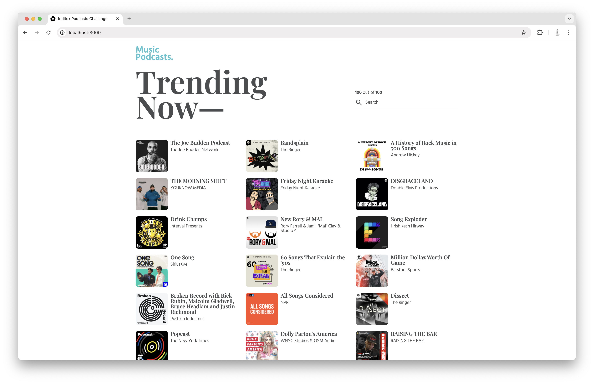
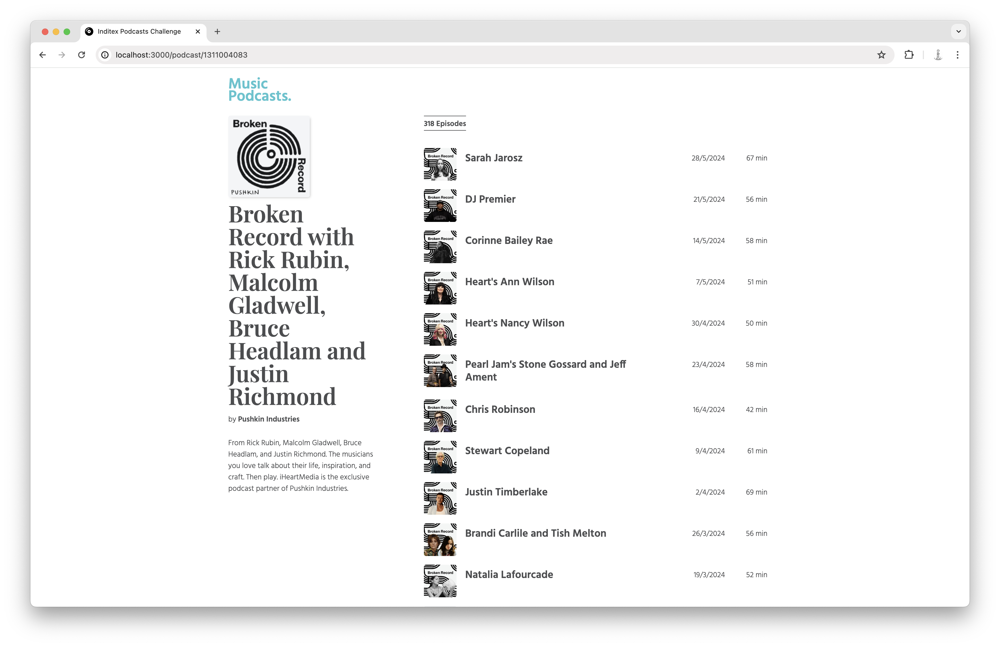
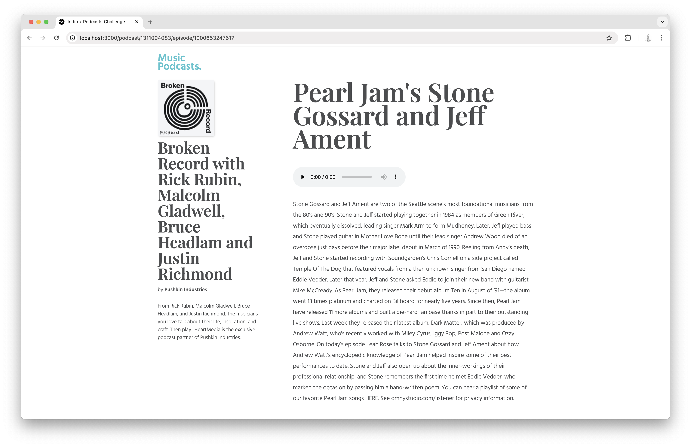

# Inditex Podcasts Challenge

This project is a podcast application built with React and TypeScript. It allows users to browse, search, and listen to podcasts.

## Screens

### Home Page: Podcasts

### Podcast Detail

### Episode Detail

## Getting Started

To get started with the project, follow these steps:

1. Clone the repository to your local machine.
2. Install the dependencies by running `npm install` or `yarn`.
3. Start the development server by running `npm run start` or `yarn start`.

## Tools Used

- **React**: Used to build the user interfaces of the application.
- **TypeScript**: Used as a typed superset of JavaScript for the project.
- **Webpack**: Used as a static module bundler.
- **Jest**: Used as a JavaScript Testing Framework for unit tests.
- **Playwright**: Used for end-to-end testing.
- **ESLint**: Used webpack's ESLintPlugin.
- **Prettier**: Opinionated code formatter.
- **Sass**: CSS preprocessor.

## Testing

Unit tests are written using Jest. To run the unit tests, use the command `npm run test` or `yarn test`.

End-to-end tests are written using Playwright. To run the end-to-end tests, use the command `npm run e2e` or `yarn e2e`.

## Project Structure

The project is structured as follows:

- `src/`: This directory contains all the source code for the application.
- `src/components/`: This directory contains all the React components.
- `src/domain/`: This directory contains the business logic of the application.
- `src/pages/`: This directory contains the page components.
- `src/infra/`: This directory contains infrastructure code, such as services for fetching data.
- `e2e/`: This directory contains end-to-end tests.

## Routes

The application uses the `react-router-dom` library to manage its routes. The routes are defined in the routes array in the [`routes.tsx`](src/adapters/router/routes.tsx) file.

- `/`: Renders [`MainPage`](src/pages/MainPage.tsx) component, this is the layout containing the [`Header`](src/components/header/Header.tsx) and the main Outlet. On `/` it also renders [`PodcastsPage`](src/pages/PodcastsPage.tsx).
- `/podcast/:id`: This route renders the [`PodcastPage`](src/pages/PodcastPage.tsx) component. It has another Outlet to render either the episodes for a given podcast through [`EpisodesPage`](src/pages/EpisodesPage.tsx) or the detail of an episode.
- `/podcast/:id/episode/:episodeId` Renders the [`EpisodePage`](src/pages/EpisodePage.tsx) component.

It fetches data through loaders defined in [`loaders.ts`](src/adapters/router/loaders.ts) which in turn use the `GetPodcasts` use cases.

## Caching

Caching in this application is implemented using the [`LocalStorageCache`](src/infra/LocalStorageCache.ts) class. This class implements the `Cache` interface from `src/domain/ports/Cache.ts`.

The `LocalStorageCache` class also has a `ttl` (time to live) property. If `ttl` is set, the cache will check the timestamp of the data when retrieving it with the get method. If the current time minus the timestamp is greater than `ttl`, the data is considered expired, removed from the cache and refetched.

## React Context Usage

In this application, React Context is used to manage loading states across the application. The [`LoadingContext`](src/adapters/context/LoadingProvider.tsx) is defined in the [`LoadingProvider`](src/adapters/context/LoadingProvider.tsx) component, which provides a `loading` state and a `setLoading` function.

## Accessibility

In order to make the application more accessible, several improvements have been made:

1. **Semantic HTML**: Proper use of HTML5 semantic elements like `<header>`, `<main>`, `<section>`, etc. This helps in making the content more understandable to assistive technologies.

2. **Alt Text for Images**: All images have meaningful alternative text. This allows screen reader users to understand the content of the images.

3. **Keyboard Navigation**: The application is fully navigable using a keyboard. This is crucial for users who cannot use a mouse or a touch screen.

4. **Contrast Ratios**: The color contrast ratios have been checked to ensure that text is easily readable, even for users with low vision.

5. **Aria Attributes**: ARIA roles and properties have been used where necessary to provide additional semantics and improve the experience for screen reader users.

6. **Focus Indicators**: Visible focus indicators have been implemented to help keyboard users navigate through the site.
